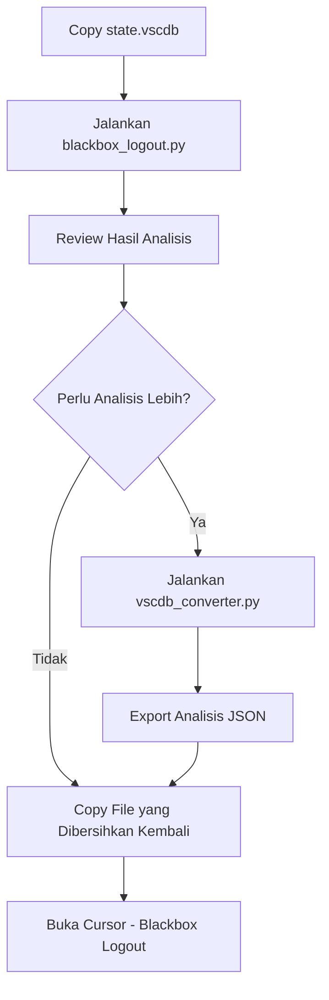

# 🛡️ Blackbox Credential Remover & State.vscdb Tools

[](https://www.python.org/)
[](LICENSE)
[]()
[]()

**Baca dalam bahasa lain:** [🇺🇸 English](README.md)

Tool profesional untuk **menghapus kredensial Blackbox** dengan aman dari Cursor/VSCode dan analisis komprehensif file `state.vscdb`. Dirancang dengan pendekatan keamanan-first dan perlindungan backup otomatis.

> **🚀 Quick Start:** Jalankan `python blackbox_logout.py` untuk menghapus kredensial Blackbox dengan aman!

## 🌐 Versi Bahasa

- 🇮🇩 [Bahasa Indonesia](README.id.md) (Current)
- 🇺🇸 [English](README.md)

## 📁 Struktur Project

```
blackbox_logout/
├── 📄 blackbox_logout.py         # Script penghapus kredensial utama (Indonesia)
├── 📄 blackbox_logout_en.py      # Main credential removal script (English)
├── 📄 vscdb_converter.py         # Tool analisis database lengkap (Indonesia)
├── 📄 vscdb_converter_en.py      # Complete database analysis tool (English)
├── 📄 quick_reader.py            # Tool pembacaan cepat dan pencarian (Indonesia)
├── 📄 quick_reader_en.py         # Quick reading and search tool (English)
├── 📄 README.id.md               # Dokumentasi Indonesia
└── 📄 README.md                  # English documentation
```

## 🚀 Overview Script

### 1. **blackbox_logout.py** - Penghapusan Kredensial Blackbox yang Aman

**Fitur Utama:**

- 🛡️ **Mode Aman**: Hanya menghapus kredensial Blackbox yang terverifikasi
- 🔒 **Backup Otomatis**: Membuat backup sebelum melakukan perubahan
- 🎯 **Penghapusan Terarah**: Melindungi semua data Cursor lainnya
- 🔍 **Analisis Cerdas**: Menganalisis setiap key sebelum penghapusan
- ✅ **Verifikasi Keamanan**: Memastikan data yang dihapus benar-benar kredensial

**Yang Akan Dihapus:**

- `Blackboxapp.blackboxagent` - Kredensial utama (userId, apiProvider, dll)
- `workbench.view.extension.blackboxai-dev-ActivityBar.state.hidden` - UI extension
- Entry history folder Blackbox (opsional, dengan konfirmasi)

**Yang Akan Dilindungi:**

- ✅ History dan setting umum Cursor
- ✅ Konfigurasi UI workbench
- ✅ Data extension lain (Python, Git, dll)
- ✅ Data tracking kode umum
- ✅ Setting notifikasi

**Penggunaan:**

```bash
# Penggunaan dasar
python blackbox_logout.py

# Dengan path database custom
python blackbox_logout.py /path/to/state.vscdb

# Mode force (lewati konfirmasi)
python blackbox_logout.py --force
```

**Output:**

```
[SAFE BLACKBOX CREDENTIAL REMOVER]
Script AMAN untuk menghapus HANYA kredensial Blackbox
====================================================

[SAFE MODE] Mode Aman Aktif:
1. Hanya menghapus kredensial Blackbox yang TERVERIFIKASI
2. Data umum Cursor (history, UI, extension lain) TIDAK akan dihapus
3. Backup otomatis akan dibuat
4. Analisis detail sebelum penghapusan

[ANALYSIS] Analisis 2 key yang ditemukan:
   1. Blackboxapp.blackboxagent
      Status: 🔑 KREDENSIAL
      Alasan: Mengandung data kredensial
      Preview: {"userId": "7614759925-3453642318-9431765582-4616178980", "apiProvider": "blackbox-pro-plus", "installed": true}

[COMPLETED] ✅ Kredensial Blackbox berhasil dihapus dengan aman!
[BACKUP] File backup tersimpan di: state.vscdb.safe_backup_20250102_123456
```

---

### 2. **vscdb_converter.py** - Analisis Database Lengkap

**Fitur Utama:**

- 🔍 **Analisis Lengkap**: Eksplorasi konten database penuh
- 📊 **Export JSON**: Export data terstruktur untuk analisis lebih lanjut
- 🔎 **Pencarian Lanjutan**: Pencarian data berdasarkan kata kunci
- 📋 **Informasi Tabel**: Schema tabel dan statistik detail
- 🛡️ **Analisis Keamanan**: Deteksi dan pelaporan data sensitif

**Penggunaan:**

```bash
# Tampilkan informasi database
python vscdb_converter.py -f state.vscdb --info

# Tampilkan data dari tabel tertentu
python vscdb_converter.py -f state.vscdb --show ItemTable

# Cari data berdasarkan kata kunci
python vscdb_converter.py -f state.vscdb --search blackbox

# Export ke file JSON
python vscdb_converter.py -f state.vscdb --export output.json

# Analisis keamanan
python vscdb_converter.py -f state.vscdb --security-scan
```

**Output:**

```
[VSCDB CONVERTER] Tool Analisis Database Lengkap
===============================================

[INFO] Database: state.vscdb
[INFO] Ukuran: 45,234,567 bytes (43.15 MB)
[INFO] Tabel: 3 (ItemTable, cursorDiskKV, ExtensionState)

[SEARCH] Ditemukan 15 hasil untuk kata kunci 'blackbox':
   1. Blackboxapp.blackboxagent - DATA KREDENSIAL
   2. workbench.view.extension.blackboxai-dev-ActivityBar.state.hidden - STATE UI
   ...

[EXPORT] Data diekspor ke: output.json
```

---

### 3. **quick_reader.py** - Pembacaan & Pencarian Cepat

**Fitur Utama:**

- ⚡ **Pembacaan Cepat**: Overview konten database yang cepat
- 🔍 **Pencarian Sederhana**: Pencarian kata kunci dasar
- 📊 **Statistik**: Statistik tabel dan data
- 🎯 **Query Terarah**: Fokus pada tipe data tertentu

**Penggunaan:**

```bash
# Baca file dari lokasi default
python quick_reader.py

# Baca file tertentu
python quick_reader.py state.vscdb

# Cari data yang mengandung kata kunci
python quick_reader.py state.vscdb blackbox

# Tampilkan statistik saja
python quick_reader.py --stats
```

**Output:**

```
[QUICK READER] Tool Pembacaan Database Cepat
===========================================

[INFO] Membaca: state.vscdb
[INFO] Ukuran: 45,234,567 bytes (43.15 MB)
[INFO] Tabel: 3

[SEARCH] Mencari 'blackbox'...
[DITEMUKAN] 15 kecocokan di 2 tabel:
   ItemTable: 12 kecocokan
   cursorDiskKV: 3 kecocokan

[STATS] Total record: 1,234,567
[STATS] Terkait Blackbox: 15 (0.001%)
```

## 🛠️ Persyaratan

**Dependensi Python:**

- Python 3.6+
- sqlite3 (built-in)
- json (built-in)
- os, sys, datetime, collections, re, pathlib (built-in)
- base64 (built-in)

**Tidak perlu instalasi package eksternal!**

## ⚡ Panduan Quick Start

### Langkah Quick Start:

```bash
# 1. Download atau clone repository
git clone <repository-url>
cd blackbox_logout

# 2. Copy file state.vscdb ke direktori ini
# (dari folder Cursor/VS Code: %APPDATA%\Cursor\User\globalStorage\state.vscdb)

# 3. Jalankan penghapusan kredensial
python blackbox_logout.py

# 4. Copy file yang sudah dibersihkan kembali ke lokasi asli
# (Ikuti perintah copy yang diberikan oleh script)
```

### 📋 Penggunaan Umum

#### 1. **Setup Environment**

```bash
# Pastikan Python 3.6+ terinstall
python --version

# Clone repository
git clone <repository-url>
cd blackbox_logout

# Copy state.vscdb dari Cursor/VS Code
# Windows: %APPDATA%\Cursor\User\globalStorage\state.vscdb
# macOS: ~/Library/Application Support/Cursor/User/globalStorage/state.vscdb
# Linux: ~/.config/Cursor/User/globalStorage/state.vscdb

cp /path/to/cursor/state.vscdb ./
```

#### 2. **Penghapusan Kredensial (Direkomendasikan)**

```bash
# Penghapusan kredensial aman dengan backup otomatis
python blackbox_logout.py

# Dengan path database custom
python blackbox_logout.py /custom/path/state.vscdb

# Mode force (lewati konfirmasi)
python blackbox_logout.py --force
```

#### 3. **Analisis Database**

```bash
# Analisis database lengkap
python vscdb_converter.py -f state.vscdb --info

# Cari data tertentu
python vscdb_converter.py -f state.vscdb --search blackbox

# Export ke JSON
python vscdb_converter.py -f state.vscdb --export analysis.json
```

#### 4. **Pembacaan Cepat**

```bash
# Overview database cepat
python quick_reader.py

# Cari kata kunci tertentu
python quick_reader.py state.vscdb blackbox

# Tampilkan statistik
python quick_reader.py --stats
```

### 🎯 **Workflow yang Direkomendasikan:**



## 🔒 Keamanan Data

**Fitur Keamanan:**

- ✅ Deteksi data sensitif otomatis
- ✅ Sensor data kredensial dan token
- ✅ Kategorisasi level sensitivitas
- ✅ Opsi export dengan/tanpa data sensitif
- ✅ Laporan keamanan dengan rekomendasi

**Level Sensitivitas:**

- 🔴 **Tinggi**: token, password, key, secret, credential
- 🟡 **Sedang**: userid, email, api, auth
- 🟢 **Rendah**: plan, status, mode, feature

**Fitur Mode Aman:**

- 🛡️ **Penghapusan Terarah**: Hanya menghapus kredensial Blackbox yang terverifikasi
- 🔍 **Analisis Cerdas**: Menganalisis setiap key sebelum penghapusan
- 🔒 **Backup Otomatis**: Membuat backup sebelum melakukan perubahan
- ✅ **Verifikasi Keamanan**: Memastikan data yang dihapus benar-benar kredensial
- 🛡️ **Perlindungan Data**: History, UI, dan extension lain tetap aman

**Yang Akan Dihapus (Hanya Kredensial):**

- `Blackboxapp.blackboxagent` - Kredensial utama (userId, apiProvider, dll)
- `workbench.view.extension.blackboxai-dev-ActivityBar.state.hidden` - UI extension
- Entry history folder Blackbox (opsional, dengan konfirmasi)

**Yang Akan Dilindungi:**

- ✅ History dan setting umum Cursor
- ✅ Konfigurasi UI workbench
- ✅ Data extension lain (Python, Git, dll)
- ✅ Data tracking kode umum
- ✅ Setting notifikasi
- ✅ Semua data umum Cursor lainnya

## 📊 Output dan Laporan

### Format Output:

- **JSON**: Data terstruktur untuk analisis lebih lanjut
- **HTML**: Laporan visual yang mudah dibaca
- **TXT**: Ringkasan dan laporan keamanan
- **File Backup**: Backup otomatis dengan timestamp

### Jenis Laporan:

1. **Analisis Kredensial**: Analisis detail kredensial yang ditemukan
2. **Laporan Keamanan**: Laporan keamanan dengan rekomendasi
3. **Statistik Database**: Statistik tabel dan data
4. **Laporan Export**: Export data terstruktur untuk analisis

## ⚡ Tips Performa

### Untuk Database Besar (>100MB):

```bash
# Gunakan mode analisis cepat
python vscdb_converter.py -f state.vscdb --quick

# Pencarian dengan batasan
python vscdb_converter.py -f state.vscdb --search blackbox --limit 1000
```

### Untuk Analisis Lengkap:

```bash
# Gunakan script yang dioptimalkan untuk performa terbaik
python vscdb_converter.py -f state.vscdb --export analysis.json
```

## 🐛 Troubleshooting

### Error Umum:

**1. File tidak ditemukan:**

```
❌ [ERROR] File state.vscdb tidak ditemukan!
💡 [SOLUSI] Copy file state.vscdb ke direktori script ini
```

**2. Database terkunci:**

```
❌ [ERROR] Database terkunci
💡 [SOLUSI] Tutup aplikasi Cursor/VS Code terlebih dahulu
```

**3. Permission denied:**

```
❌ [ERROR] Permission denied
💡 [SOLUSI] Jalankan sebagai administrator atau periksa permission file
```

**4. Gagal membuat backup:**

```
❌ [ERROR] Tidak dapat membuat backup
💡 [SOLUSI] Periksa ruang disk dan permission write
```

### Langkah Troubleshooting:

```bash
# 1. Periksa versi Python
python --version

# 2. Verifikasi permission file
ls -la state.vscdb

# 3. Test integritas database
python -c "import sqlite3; sqlite3.connect('state.vscdb').close()"

# 4. Periksa ruang disk yang tersedia
df -h

# 5. Jalankan dengan logging verbose
python blackbox_logout.py --verbose
```

## 🔧 Matriks Kompatibilitas

| Platform              | Versi Python | Status            | Catatan                  |
| --------------------- | ------------ | ----------------- | ------------------------ |
| Windows 10+           | 3.6 - 3.12   | ✅ Dukungan Penuh | Diuji pada Windows 11    |
| macOS 10.15+          | 3.6 - 3.12   | ✅ Dukungan Penuh | Diuji pada macOS 12+     |
| Linux (Ubuntu/CentOS) | 3.6 - 3.12   | ✅ Dukungan Penuh | Diuji pada Ubuntu 20.04+ |
| WSL                   | 3.6 - 3.12   | ✅ Dukungan Penuh | Sama dengan Windows      |

### Kompatibilitas Database

- ✅ **SQLite 3.x** (semua versi)
- ✅ **File state.vscdb Cursor**
- ✅ **File state.vscdb VS Code**
- ✅ **Database SQLite custom**

### Batasan Ukuran File

- ⚡ **Mode Cepat**: Database hingga 500MB
- 🔍 **Mode Lengkap**: Database hingga 2GB (dengan RAM cukup)
- 📊 **Converter**: Database hingga 5GB

## 📍 Lokasi File State.vscdb

File `state.vscdb` biasanya berada di:

**Windows:**

```
C:\Users\[USERNAME]\AppData\Roaming\Cursor\User\globalStorage\state.vscdb
```

**macOS:**

```
~/Library/Application Support/Cursor/User/globalStorage/state.vscdb
```

**Linux:**

```
~/.config/Cursor/User/globalStorage/state.vscdb
```

## 📈 Changelog

### Versi 1.0 (Current)

- ✅ **BARU:** Script penghapusan kredensial Blackbox yang aman
- ✅ **BARU:** Tool analisis database lengkap
- ✅ **BARU:** Fungsi pembacaan cepat dan pencarian
- ✅ **BARU:** Perlindungan backup otomatis
- ✅ **BARU:** Analisis keamanan dan pelaporan
- ✅ **BARU:** Dukungan multi-bahasa (Indonesia/English)
- ✅ **DIPERBAIKI:** Penanganan error dan feedback pengguna
- ✅ **DIPERBAIKI:** Kompatibilitas lintas platform

## 🎯 Contoh Penggunaan Lanjutan

### Analisis Custom

```bash
# Analisis kata kunci tertentu saja
python vscdb_converter.py -f state.vscdb --search "token,password,api_key"

# Export dengan format custom
python vscdb_converter.py -f state.vscdb --export analysis.json --format json

# Scan keamanan dengan laporan detail
python vscdb_converter.py -f state.vscdb --security-scan --detailed
```

### Optimasi Performa

```bash
# Analisis cepat untuk database besar
python vscdb_converter.py -f state.vscdb --quick --limit 1000

# Pemrosesan paralel (jika didukung)
python vscdb_converter.py -f state.vscdb --parallel --threads 4
```

### Pemrosesan Batch

```bash
# Proses multiple database
for db in *.vscdb; do
    python blackbox_logout.py "$db"
done
```

## 🚨 Catatan Keamanan Penting

1. **SELALU tutup Cursor/VSCode** sebelum menjalankan script
2. **Script hanya bekerja dengan file lokal** untuk keamanan (tidak pernah memodifikasi file asli langsung)
3. **Backup otomatis** akan dibuat sebelum perubahan
4. **Hanya kredensial Blackbox** yang akan dihapus
5. **Copy-paste manual diperlukan** - script tidak otomatis mengganti file asli
6. **Test dengan copy dulu** - file asli tetap aman sampai Anda manual menggantinya

### 🛡️ Mengapa Metode Copy-Paste Lebih Aman

- ✅ **File asli terlindungi** - script tidak pernah menyentuh file asli
- ✅ **Kontrol manual** - Anda yang memutuskan kapan menerapkan perubahan
- ✅ **Mudah rollback** - simpan file asli sebagai backup
- ✅ **Tidak ada overwrite tidak sengaja** - script hanya bekerja pada copy

## 🤝 Contributing

### Cara Berkontribusi

1. **Fork** repository
2. **Buat** branch fitur (`git checkout -b feature/fitur-menakjubkan`)
3. **Commit** perubahan Anda (`git commit -m 'Tambah fitur menakjubkan'`)
4. **Push** ke branch (`git push origin feature/fitur-menakjubkan`)
5. **Buka** Pull Request

### Panduan Development

- 📝 **Dokumentasi:** Update README untuk fitur baru
- 🧪 **Testing:** Test di multiple platform (Windows/macOS/Linux)
- 🔒 **Keamanan:** Pastikan tidak ada kebocoran data sensitif
- ⚡ **Performa:** Optimalkan untuk dataset besar
- 🐛 **Bug Fixes:** Sertakan test case untuk perbaikan

## 📄 License

Project ini dilisensikan di bawah MIT License - lihat file [LICENSE](LICENSE) untuk detail.

**Penting:** Script ini dibuat untuk analisis database dan manajemen kredensial. Gunakan dengan bertanggung jawab dan pastikan data sensitif tetap aman.

---

## 🎉 Getting Started

**Siap menghapus kredensial Blackbox dengan aman?**

```bash
# Quick start dalam 3 langkah:
git clone <repository-url>
cd blackbox_logout
python blackbox_logout.py
```

**Butuh bantuan?** Cek [section troubleshooting](#-troubleshooting) atau buka issue.

---

**💡 Pro Tips:**

- Mulai dengan `blackbox_logout.py` untuk penghapusan kredensial yang aman
- Gunakan `vscdb_converter.py` untuk eksplorasi database lengkap
- Selalu backup file database asli Anda
- Test dengan copy sebelum menerapkan perubahan ke file asli
