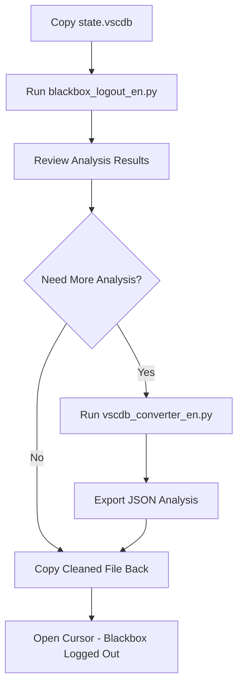

# 🛡️ Blackbox Credential Remover & State.vscdb Tools

[](https://www.python.org/)
[](LICENSE)
[]()
[]()

**Read this in other languages:** [🇮🇩 Indonesia](README.id.md)

Professional tools for **safely removing Blackbox credentials** from Cursor/VSCode and comprehensive analysis of `state.vscdb` files. Designed with security-first approach and automatic backup protection.

> **🚀 Quick Start:** Run `python blackbox_logout_en.py` to safely remove Blackbox credentials!

## 🌐 Language Versions

- 🇺🇸 [English](README.md) (Current)
- 🇮🇩 [Bahasa Indonesia](README.id.md)

## 📁 Project Structure

```
blackbox_logout/
├── 📄 blackbox_logout_en.py      # Main credential removal script (English)
├── 📄 blackbox_logout.py         # Script penghapus kredensial utama (Indonesia)
├── 📄 vscdb_converter_en.py      # Complete database analysis tool (English)
├── 📄 vscdb_converter.py         # Tool analisis database lengkap (Indonesia)
├── 📄 quick_reader_en.py         # Quick reading and search tool (English)
├── 📄 quick_reader.py            # Tool pembacaan cepat dan pencarian (Indonesia)
├── 📄 README.md                  # English documentation
└── 📄 README.id.md               # Dokumentasi Indonesia
```

## 🚀 Script Overview

### 1. **blackbox_logout_en.py** - Safe Blackbox Credential Removal

**Key Features:**

- 🛡️ **Safe Mode**: Only removes verified Blackbox credentials
- 🔒 **Automatic Backup**: Creates backup before any changes
- 🎯 **Targeted Removal**: Preserves all other Cursor data
- 🔍 **Smart Analysis**: Analyzes each key before deletion
- ✅ **Security Verification**: Ensures deleted data is actually credentials

**What Gets Removed:**

- `Blackboxapp.blackboxagent` - Main credentials (userId, apiProvider, etc.)
- `workbench.view.extension.blackboxai-dev-ActivityBar.state.hidden` - Extension UI
- Blackbox history folder entries (optional, with confirmation)

**What Gets Protected:**

- ✅ General Cursor history and settings
- ✅ Workbench UI configurations
- ✅ Other extension data (Python, Git, etc.)
- ✅ General code tracking data
- ✅ Notification settings

**Usage:**

```bash
# Basic usage
python blackbox_logout_en.py

# With custom database path
python blackbox_logout_en.py /path/to/state.vscdb

# Force mode (skip confirmations)
python blackbox_logout_en.py --force
```

**Output:**

```
[SAFE BLACKBOX CREDENTIAL REMOVER]
SAFE script for removing ONLY Blackbox credentials
==================================================

[SAFE MODE] Safe Mode Active:
1. Only removes VERIFIED Blackbox credentials
2. General Cursor data (history, UI, other extensions) will NOT be removed
3. Automatic backup will be created
4. Detailed analysis before deletion

[ANALYSIS] Analysis of 2 keys found:
   1. Blackboxapp.blackboxagent
      Status: 🔑 CREDENTIAL
      Reason: Contains credential data
      Preview: {"userId": "7614759925-3453642318-9431765582-4616178980", "apiProvider": "blackbox-pro-plus", "installed": true}

[COMPLETED] ✅ Blackbox credentials successfully removed safely!
[BACKUP] Backup file saved at: state.vscdb.safe_backup_20250102_123456
```

---

### 2. **vscdb_converter_en.py** - Complete Database Analysis

**Key Features:**

- 🔍 **Complete Analysis**: Full database content exploration
- 📊 **JSON Export**: Structured data export for further analysis
- 🔎 **Advanced Search**: Keyword-based data searching
- 📋 **Table Information**: Detailed table schema and statistics
- 🛡️ **Security Analysis**: Sensitive data detection and reporting

**Usage:**

```bash
# Display database information
python vscdb_converter_en.py -f state.vscdb --info

# Display data from specific table
python vscdb_converter_en.py -f state.vscdb --show ItemTable

# Search data by keywords
python vscdb_converter_en.py -f state.vscdb --search blackbox

# Export to JSON file
python vscdb_converter_en.py -f state.vscdb --export output.json

# Security analysis
python vscdb_converter_en.py -f state.vscdb --security-scan
```

**Output:**

```
[VSCDB CONVERTER] Complete Database Analysis Tool
================================================

[INFO] Database: state.vscdb
[INFO] Size: 45,234,567 bytes (43.15 MB)
[INFO] Tables: 3 (ItemTable, cursorDiskKV, ExtensionState)

[SEARCH] Found 15 results for keyword 'blackbox':
   1. Blackboxapp.blackboxagent - CREDENTIAL DATA
   2. workbench.view.extension.blackboxai-dev-ActivityBar.state.hidden - UI STATE
   ...

[EXPORT] Data exported to: output.json
```

---

### 3. **quick_reader_en.py** - Quick Reading & Search

**Key Features:**

- ⚡ **Fast Reading**: Quick database content overview
- 🔍 **Simple Search**: Basic keyword searching
- 📊 **Statistics**: Table and data statistics
- 🎯 **Targeted Queries**: Focus on specific data types

**Usage:**

```bash
# Read file from default location
python quick_reader_en.py

# Read specific file
python quick_reader_en.py state.vscdb

# Search data containing keywords
python quick_reader_en.py state.vscdb blackbox

# Show statistics only
python quick_reader_en.py --stats
```

**Output:**

```
[QUICK READER] Fast Database Reading Tool
========================================

[INFO] Reading: state.vscdb
[INFO] Size: 45,234,567 bytes (43.15 MB)
[INFO] Tables: 3

[SEARCH] Searching for 'blackbox'...
[FOUND] 15 matches in 2 tables:
   ItemTable: 12 matches
   cursorDiskKV: 3 matches

[STATS] Total records: 1,234,567
[STATS] Blackbox-related: 15 (0.001%)
```

## 🛠️ Requirements

**Python Dependencies:**

- Python 3.6+
- sqlite3 (built-in)
- json (built-in)
- os, sys, datetime, collections, re, pathlib (built-in)
- base64 (built-in)

**No external package installation required!**

## ⚡ Quick Start Guide

### Quick Start Steps:

```bash
# 1. Download or clone repository
git clone <repository-url>
cd blackbox_logout

# 2. Copy state.vscdb file to this directory
# (from Cursor/VS Code folder: %APPDATA%\Cursor\User\globalStorage\state.vscdb)

# 3. Run credential removal
python blackbox_logout_en.py

# 4. Copy cleaned file back to original location
# (Follow the copy command provided by the script)
```

### 📋 General Usage

#### 1. **Environment Setup**

```bash
# Ensure Python 3.6+ is installed
python --version

# Clone repository
git clone <repository-url>
cd blackbox_logout

# Copy state.vscdb from Cursor/VS Code
# Windows: %APPDATA%\Cursor\User\globalStorage\state.vscdb
# macOS: ~/Library/Application Support/Cursor/User/globalStorage/state.vscdb
# Linux: ~/.config/Cursor/User/globalStorage/state.vscdb

cp /path/to/cursor/state.vscdb ./
```

#### 2. **Credential Removal (Recommended)**

```bash
# Safe credential removal with automatic backup
python blackbox_logout_en.py

# With custom database path
python blackbox_logout_en.py /custom/path/state.vscdb

# Force mode (skip confirmations)
python blackbox_logout_en.py --force
```

#### 3. **Database Analysis**

```bash
# Complete database analysis
python vscdb_converter_en.py -f state.vscdb --info

# Search for specific data
python vscdb_converter_en.py -f state.vscdb --search blackbox

# Export to JSON
python vscdb_converter_en.py -f state.vscdb --export analysis.json
```

#### 4. **Quick Reading**

```bash
# Quick database overview
python quick_reader_en.py

# Search specific keywords
python quick_reader_en.py state.vscdb blackbox

# Show statistics
python quick_reader_en.py --stats
```

### 🎯 **Recommended Workflow:**



## 🔒 Data Security

**Security Features:**

- ✅ Automatic sensitive data detection
- ✅ Credential and token data censoring
- ✅ Sensitivity level categorization
- ✅ Export options with/without sensitive data
- ✅ Security report with recommendations

**Sensitivity Levels:**

- 🔴 **High**: token, password, key, secret, credential
- 🟡 **Medium**: userid, email, api, auth
- 🟢 **Low**: plan, status, mode, feature

**Safe Mode Features:**

- 🛡️ **Targeted Removal**: Only removes verified Blackbox credentials
- 🔍 **Smart Analysis**: Analyzes each key before deletion
- 🔒 **Automatic Backup**: Creates backup before making changes
- ✅ **Security Verification**: Ensures deleted data is actually credentials
- 🛡️ **Data Protection**: History, UI, and other extensions remain safe

**What Gets Removed (Credentials Only):**

- `Blackboxapp.blackboxagent` - Main credentials (userId, apiProvider, etc.)
- `workbench.view.extension.blackboxai-dev-ActivityBar.state.hidden` - Extension UI
- Blackbox history folder entries (optional, with confirmation)

**What Gets Protected:**

- ✅ General Cursor history and settings
- ✅ Workbench UI configurations
- ✅ Other extension data (Python, Git, etc.)
- ✅ General code tracking data
- ✅ Notification settings
- ✅ All other general Cursor data

## 📊 Output and Reports

### Output Formats:

- **JSON**: Structured data for further analysis
- **HTML**: Visual reports that are easy to read
- **TXT**: Summary and security reports
- **Backup Files**: Automatic backup with timestamp

### Report Types:

1. **Credential Analysis**: Detailed analysis of found credentials
2. **Security Report**: Security report with recommendations
3. **Database Statistics**: Table and data statistics
4. **Export Reports**: Structured data export for analysis

## ⚡ Performance Tips

### For Large Databases (>100MB):

```bash
# Use quick analysis mode
python vscdb_converter_en.py -f state.vscdb --quick

# Search with limits
python vscdb_converter_en.py -f state.vscdb --search blackbox --limit 1000
```

### For Complete Analysis:

```bash
# Use optimized script for best performance
python vscdb_converter_en.py -f state.vscdb --export analysis.json
```

## 🐛 Troubleshooting

### Common Errors:

**1. File not found:**

```
❌ [ERROR] File state.vscdb not found!
💡 [SOLUTION] Copy state.vscdb file to this script directory
```

**2. Database locked:**

```
❌ [ERROR] Database is locked
💡 [SOLUTION] Close Cursor/VS Code application first
```

**3. Permission denied:**

```
❌ [ERROR] Permission denied
💡 [SOLUTION] Run as administrator or check file permissions
```

**4. Backup creation failed:**

```
❌ [ERROR] Cannot create backup
💡 [SOLUTION] Check disk space and write permissions
```

### Troubleshooting Steps:

```bash
# 1. Check Python version
python --version

# 2. Verify file permissions
ls -la state.vscdb

# 3. Test database integrity
python -c "import sqlite3; sqlite3.connect('state.vscdb').close()"

# 4. Check available disk space
df -h

# 5. Run with verbose logging
python blackbox_logout_en.py --verbose
```

## 🔧 Compatibility Matrix

| Platform              | Python Version | Status          | Notes                   |
| --------------------- | -------------- | --------------- | ----------------------- |
| Windows 10+           | 3.6 - 3.12     | ✅ Full Support | Tested on Windows 11    |
| macOS 10.15+          | 3.6 - 3.12     | ✅ Full Support | Tested on macOS 12+     |
| Linux (Ubuntu/CentOS) | 3.6 - 3.12     | ✅ Full Support | Tested on Ubuntu 20.04+ |
| WSL                   | 3.6 - 3.12     | ✅ Full Support | Same as Windows         |

### Database Compatibility

- ✅ **SQLite 3.x** (all versions)
- ✅ **Cursor state.vscdb** files
- ✅ **VS Code state.vscdb** files
- ✅ **Custom SQLite databases**

### File Size Limits

- ⚡ **Quick Mode**: Up to 500MB databases
- 🔍 **Full Mode**: Up to 2GB databases (with sufficient RAM)
- 📊 **Converter**: Up to 5GB databases

## 📍 State.vscdb File Location

The `state.vscdb` file is usually located at:

**Windows:**

```
C:\Users\[USERNAME]\AppData\Roaming\Cursor\User\globalStorage\state.vscdb
```

**macOS:**

```
~/Library/Application Support/Cursor/User/globalStorage/state.vscdb
```

**Linux:**

```
~/.config/Cursor/User/globalStorage/state.vscdb
```

## 📈 Changelog

### Version 1.0 (Current)

- ✅ **NEW:** Safe Blackbox credential removal script
- ✅ **NEW:** Complete database analysis tools
- ✅ **NEW:** Quick reading and search functionality
- ✅ **NEW:** Automatic backup protection
- ✅ **NEW:** Security analysis and reporting
- ✅ **NEW:** Multi-language support (English/Indonesian)
- ✅ **IMPROVED:** Error handling and user feedback
- ✅ **IMPROVED:** Cross-platform compatibility

## 🎯 Advanced Usage Examples

### Custom Analysis

```bash
# Analyze specific keywords only
python vscdb_converter_en.py -f state.vscdb --search "token,password,api_key"

# Export with custom format
python vscdb_converter_en.py -f state.vscdb --export analysis.json --format json

# Security scan with detailed report
python vscdb_converter_en.py -f state.vscdb --security-scan --detailed
```

### Performance Optimization

```bash
# Quick analysis for large databases
python vscdb_converter_en.py -f state.vscdb --quick --limit 1000

# Parallel processing (if supported)
python vscdb_converter_en.py -f state.vscdb --parallel --threads 4
```

### Batch Processing

```bash
# Process multiple databases
for db in *.vscdb; do
    python blackbox_logout_en.py "$db"
done
```

## 🚨 Important Security Notes

1. **ALWAYS close Cursor/VSCode** before running the script
2. **Script only works with local files** for security (never modifies original directly)
3. **Automatic backup** will be created before changes
4. **Only Blackbox credentials** will be removed
5. **Manual copy-paste required** - script doesn't auto-replace original file
6. **Test with copy first** - original file remains untouched until you manually replace it

### 🛡️ Why Copy-Paste Method is Safer

- ✅ **Original file protected** - script never touches the original
- ✅ **Manual control** - you decide when to apply changes
- ✅ **Easy rollback** - keep original as backup
- ✅ **No accidental overwrites** - script works on copies only

## 🤝 Contributing

### How to Contribute

1. **Fork** the repository
2. **Create** a feature branch (`git checkout -b feature/amazing-feature`)
3. **Commit** your changes (`git commit -m 'Add amazing feature'`)
4. **Push** to the branch (`git push origin feature/amazing-feature`)
5. **Open** a Pull Request

### Development Guidelines

- 📝 **Documentation:** Update README for new features
- 🧪 **Testing:** Test on multiple platforms (Windows/macOS/Linux)
- 🔒 **Security:** Ensure no sensitive data leaks
- ⚡ **Performance:** Optimize for large datasets
- 🐛 **Bug Fixes:** Include test cases for fixes

## 📄 License

This project is licensed under the MIT License - see the [LICENSE](LICENSE) file for details.

**Important:** These scripts are created for database analysis and credential management purposes. Use responsibly and ensure sensitive data remains secure.

---

## 🎉 Getting Started

**Ready to remove Blackbox credentials safely?**

```bash
# Quick start in 3 steps:
git clone <repository-url>
cd blackbox_logout
python blackbox_logout_en.py
```

**Need help?** Check the [troubleshooting section](https://github.com/fajarkurnia0388/blackbox_logout/issues) or open an issue.

---

**💡 Pro Tips:**

- Start with `blackbox_logout_en.py` for safe credential removal
- Use `vscdb_converter_en.py` for complete database exploration
- Always backup your original database files
- Test with copies before applying changes to original files

